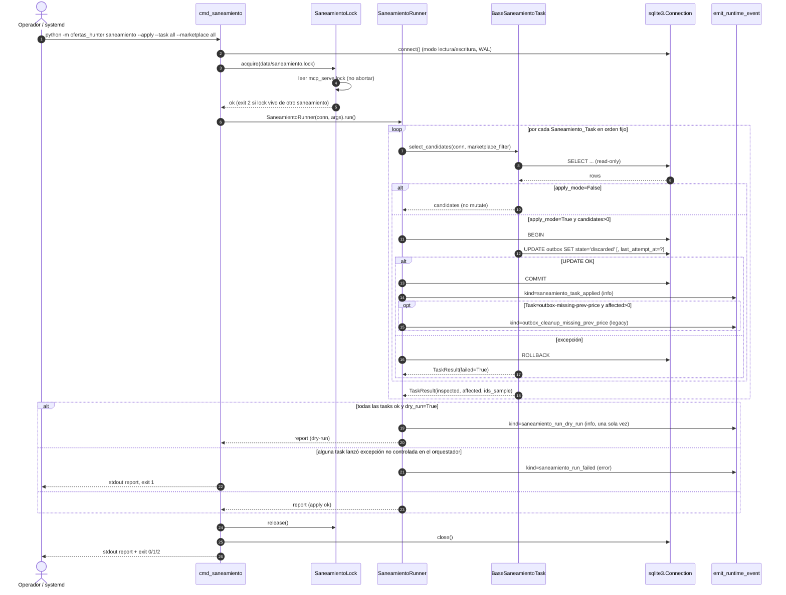

# Design Document

## Overview

`bot-saneamiento-vps` consolida los scripts ad-hoc `scripts/_vps_cleanup_stale.py`, `scripts/_vps_cleanup_duplicates.py`, `scripts/_vps_cleanup_bad_discounts.py` y `scripts/cleanup_outbox_missing_prev_price.py` en un módulo Python testeable expuesto como un único subcomando del paquete existente: `python -m ofertas_hunter saneamiento`.

Decisiones de diseño guía:

- **Reuso total de la infraestructura del Bot_Principal.** El Bot_Saneamiento abre la DB con `ofertas_hunter.db.connect`, audita con `ofertas_hunter.runtime.events.emit_runtime_event`, y resuelve rutas con `ofertas_hunter.config.get_settings`. No introduce capas DB nuevas.
- **Aislamiento por proceso, no por hilo.** Es un proceso oneshot disparado por un `.timer` independiente. No se monta dentro del orchestrator ni del watchdog.
- **Paridad estricta con los scripts existentes.** Los selectores SQL, el cutoff de 4 horas para stale, las 48 horas para duplicados, el umbral de 3 puntos porcentuales para `discount_percent`, y la exclusión de `price_error_confirmed` para missing-prev-price provienen literalmente de los scripts y se documentan en cada `Saneamiento_Task`.
- **Dry-Run por defecto, Apply_Mode opt-in.** Cualquier mutación requiere `--apply`. Cada `Saneamiento_Task` se aplica en su propia transacción SQLite explícita; un fallo en una `Saneamiento_Task` hace rollback solo de esa, sin abortar las restantes.
- **Idempotencia y no-borrado.** El bot solo hace `UPDATE outbox SET state='discarded'` (y `last_attempt_at` excepto para `outbox-missing-prev-price`). Nunca `DELETE`, nunca toca `published_messages` ni `message_payload_json`.
- **Compatibilidad de auditoría.** Se preserva el `runtime_events.kind='outbox_cleanup_missing_prev_price'` legacy para no romper alarmas existentes, y se añaden tres `kind` nuevos: `saneamiento_task_applied`, `saneamiento_run_dry_run`, `saneamiento_run_failed`.
- **Despliegue separado.** Se entregan `deploy/systemd/ofertas-hunter-saneamiento.{service,timer}` con `Type=oneshot`, `OnUnitActiveSec=6h` y `OnBootSec=45min` (vs `OnBootSec=15min` del maintenance.timer existente) para escalonar los dos timers.

## Architecture

### Diagrama de componentes

```mermaid
graph TB
    subgraph CLI["python -m ofertas_hunter saneamiento"]
        ARGS[ArgumentParser saneamiento subcommand]
    end

    subgraph SAN["src/ofertas_hunter/saneamiento/"]
        RUNNER[SaneamientoRunner]
        LOCK[SaneamientoLock]
        REPORT[SaneamientoReport]
        TASK_BASE[BaseSaneamientoTask]
        T1[OutboxDuplicatesTask]
        T2[OutboxMissingPrevPriceTask]
        T3[OutboxBadDiscountsTask]
        T4[OutboxStaleTask]
    end

    subgraph SHARED["ofertas_hunter (existente)"]
        DB[db.connect]
        EVENTS[runtime.events.emit_runtime_event]
        CONFIG[config.get_settings]
    end

    subgraph FS["Filesystem"]
        LOCKFILE[data/saneamiento.lock]
        MCPLOCK[data/mcp_serve.lock]
        SQLITE[(data/ofertas_hunter.db)]
    end

    ARGS --> RUNNER
    RUNNER --> LOCK
    RUNNER --> TASK_BASE
    TASK_BASE <|-- T1
    TASK_BASE <|-- T2
    TASK_BASE <|-- T3
    TASK_BASE <|-- T4
    RUNNER --> REPORT
    LOCK -->|read-only check| MCPLOCK
    LOCK -->|write/release| LOCKFILE
    TASK_BASE --> DB
    RUNNER --> EVENTS
    RUNNER --> CONFIG
    DB --> SQLITE
    EVENTS --> SQLITE
```

### Diagrama de secuencia de un `Saneamiento_Run`



### Flujo de control y modos de salida

| Condición                                                   | Exit code | Eventos emitidos                                                                |
|-------------------------------------------------------------|-----------|---------------------------------------------------------------------------------|
| Run completa OK en Dry_Run                                  | `0`       | `saneamiento_run_dry_run` (info, 1 vez)                                         |
| Run completa OK en Apply_Mode con tasks afectadas           | `0`       | `saneamiento_task_applied` por task con `affected>0`; legacy si aplica          |
| Run completa OK en Apply_Mode con cero candidatos en todas  | `0`       | Ningún evento por task; sin `saneamiento_run_dry_run`                           |
| Una `Saneamiento_Task` falla pero el resto continúa         | `0`       | Otras tasks emiten su evento; el fallo queda en el report stdout                |
| Excepción no controlada en el orquestador                   | `1`       | `saneamiento_run_failed` (error)                                                |
| Otro `data/saneamiento.lock` vivo                           | `2`       | Ninguno; stdout imprime `pid` y `started_at` del holder                         |

## Components and Interfaces

### Layout del módulo

```
src/ofertas_hunter/saneamiento/
├── __init__.py            # exporta SaneamientoRunner, BaseSaneamientoTask, TaskResult, SaneamientoReport
├── cli.py                 # cmd_saneamiento(args) — entrypoint usado por __main__.py
├── lockfile.py            # SaneamientoLock (wrapper sobre la lógica de mcp/lockfile.py)
├── report.py              # TaskResult, SaneamientoReport, formato stdout
├── runner.py              # SaneamientoRunner: orquesta lock + tasks + eventos
├── tasks/
│   ├── __init__.py        # registry: TASK_REGISTRY = {name: cls}
│   ├── base.py            # BaseSaneamientoTask (ABC) + helpers SQL marketplace
│   ├── outbox_duplicates.py
│   ├── outbox_missing_prev_price.py
│   ├── outbox_bad_discounts.py
│   └── outbox_stale.py
└── time_source.py         # now_utc_iso() + cutoff_iso(hours) inyectables en tests
```

### Wiring en `__main__.py`

`__main__.py` añade un único subcomando nuevo:

```python
sp_san = sub.add_parser(
    "saneamiento",
    help="Bot de saneamiento (housekeeping del outbox). Dry-run por defecto.",
)
sp_san.add_argument(
    "--task",
    choices=("outbox-stale", "outbox-duplicates", "outbox-bad-discounts",
             "outbox-missing-prev-price", "all"),
    default="all",
)
sp_san.add_argument("--apply", action="store_true",
                    help="Sin este flag, la run es Dry_Run.")
sp_san.add_argument("--marketplace",
                    choices=("amazon", "mercadolibre", "all"),
                    default="all")
```

`cmd_saneamiento(args)` delega en `saneamiento.cli.cmd_saneamiento(args)` y devuelve su exit code (`0`, `1` o `2`). No instancia orchestrator, hunters, dispatcher, watchdog ni MCP server (Requirement 2.3).

### `SaneamientoRunner`

```python
@dataclass
class SaneamientoRunArgs:
    task: str                  # "all" o uno de los 4 nombres canónicos
    apply_mode: bool           # False = Dry_Run
    marketplace: str           # "amazon" | "mercadolibre" | "all"

class SaneamientoRunner:
    def __init__(
        self,
        conn: sqlite3.Connection,
        args: SaneamientoRunArgs,
        *,
        clock: Callable[[], datetime] = lambda: datetime.now(timezone.utc),
        registry: Mapping[str, type[BaseSaneamientoTask]] = TASK_REGISTRY,
    ) -> None: ...

    def run(self) -> SaneamientoReport: ...
```

Responsabilidades:

1. Resolver el subset de tasks a ejecutar usando el orden canónico del Requirement 4.1: `outbox-duplicates → outbox-missing-prev-price → outbox-bad-discounts → outbox-stale`.
2. Para cada task, llamar `task.select_candidates(conn, marketplace, clock)` (siempre se ejecuta, en Dry_Run y en Apply_Mode).
3. En Apply_Mode con `len(candidates) > 0`: abrir transacción explícita (`conn.execute("BEGIN")`), llamar `task.apply(conn, candidates, clock)`, hacer `COMMIT`. Si la transacción levanta cualquier excepción: `ROLLBACK`, registrar en `TaskResult.error` y continuar con la siguiente task (Requirement 3.5).
4. Tras procesar todas las tasks, emitir los `runtime_events` que correspondan según el modo (ver matriz arriba).
5. Construir y devolver el `SaneamientoReport`.

### `BaseSaneamientoTask`

```python
class BaseSaneamientoTask(abc.ABC):
    name: ClassVar[str]                # "outbox-stale", etc. — usado en CLI y eventos
    writes_last_attempt_at: ClassVar[bool] = True  # False sólo en outbox-missing-prev-price

    @abc.abstractmethod
    def select_candidates(
        self, conn: sqlite3.Connection, *,
        marketplace: str, clock: Callable[[], datetime],
    ) -> list[CandidateRow]: ...

    def apply(
        self, conn: sqlite3.Connection,
        candidates: list[CandidateRow], *,
        clock: Callable[[], datetime],
    ) -> int:
        """Devuelve número de filas afectadas. Implementación default: UPDATE
        outbox SET state='discarded' [, last_attempt_at=?] WHERE id=?
        AND state='pending'."""

@dataclass(frozen=True)
class CandidateRow:
    outbox_id: int
    marketplace: str | None
    title: str | None
    extra: dict[str, Any] = field(default_factory=dict)  # current/prev/disc, etc.
```

El `apply` por defecto vive en `BaseSaneamientoTask` para garantizar que las cuatro tasks compartan el mismo SQL UPDATE (consistencia → idempotencia + no-borrado, ver Correctness Properties). Cada subclase solo define `select_candidates`.

### Helper `_marketplace_filter_sql`

```python
def marketplace_clause(marketplace: str) -> tuple[str, tuple[Any, ...]]:
    """Devuelve (sql_fragment, params).

    marketplace='all'  → ("", ())                       # sin filtro
    marketplace='amazon' o 'mercadolibre' →
        (" AND LOWER(p.marketplace) = ? ", (marketplace,))
    """
```

Se usa en las cuatro tasks para joinear `outbox o JOIN offers of ON of.id=o.offer_id JOIN products p ON p.id=of.product_id` y aplicar el filtro (Requirement 4.7).

### `SaneamientoLock`

Wrapper específico sobre la lógica de `mcp/lockfile.py`. NO se reusa la clase `FileLock` directamente porque `SaneamientoLock` debe:

- Convivir tolerantemente con `data/mcp_serve.lock` (Requirement 2.5): si existe y está vivo, registra el dato en el report pero NO aborta.
- Usar su propio path `data/saneamiento.lock`.
- Exponer `coexists_with_mcp_serve: bool` para que el report registre la concurrencia.
- Detectar lock huérfano (pid muerto) y sobrescribirlo (paridad con `FileLock._read` + `_pid_is_alive`).

```python
@dataclass
class SaneamientoLock:
    path: Path                      # data/saneamiento.lock
    mcp_lock_path: Path | None      # data/mcp_serve.lock (sólo lectura)

    def acquire(self) -> LockAcquisition: ...   # raises SaneamientoLockBusy
    def release(self) -> None: ...

@dataclass(frozen=True)
class LockAcquisition:
    mcp_serve_active: bool          # Requirement 2.5
    holder: dict[str, object]       # pid + started_at del lock recién escrito

class SaneamientoLockBusy(RuntimeError):
    holder: dict[str, object]       # pid + started_at del que ya tiene el lock
```

`acquire()`:
1. Lee `data/saneamiento.lock`. Si existe y `_pid_is_alive(pid)`: levanta `SaneamientoLockBusy` con el holder.
2. Si existe pero el pid está muerto: lo sobrescribe (lock huérfano).
3. Lee `data/mcp_serve.lock` solo para detectar concurrencia, sin tocarlo.
4. Escribe `{"pid": os.getpid(), "scope": "saneamiento", "started_at": "<now>Z"}`.

## Data Models

### Lock file `data/saneamiento.lock`

Formato JSON UTF-8 (paridad con `mcp_serve.lock`):

```json
{
  "pid": 12345,
  "scope": "saneamiento",
  "started_at": "2026-05-29T12:34:56.789Z"
}
```

Campos:

| Campo        | Tipo    | Descripción                                                  |
|--------------|---------|--------------------------------------------------------------|
| `pid`        | int     | PID del proceso del Bot_Saneamiento que tiene el lock.       |
| `scope`      | string  | Literalmente `"saneamiento"`.                                |
| `started_at` | string  | Timestamp UTC ISO-8601 con sufijo `Z`, milisegundos.         |

Mensaje impreso en stdout cuando otro `saneamiento.lock` está vivo (exit 2):

```
ERROR: data/saneamiento.lock activo: pid=12345 started_at=2026-05-29T12:34:56.789Z
```

### `TaskResult`

```python
@dataclass(frozen=True)
class TaskResult:
    task: str                            # "outbox-stale", etc.
    mode: Literal["dry-run", "apply"]
    marketplace_filter: str              # "amazon" | "mercadolibre" | "all"
    inspected: int                       # len(candidates)
    affected: int                        # filas mutadas; 0 en Dry_Run
    ids_sample: list[int]                # hasta 30, ascendentes por outbox.id
    error: str | None = None             # "<ExcType>: <msg>" si la transacción falló
    skipped_reason: str | None = None    # reservado para futuros skips por config
```

### `SaneamientoReport`

```python
@dataclass(frozen=True)
class SaneamientoReport:
    started_at: str                      # ISO-8601 Z
    finished_at: str                     # ISO-8601 Z
    mode: Literal["dry-run", "apply"]
    marketplace_filter: str
    mcp_serve_active: bool               # del LockAcquisition
    tasks: list[TaskResult]              # en orden de ejecución

    @property
    def total_inspected(self) -> int: ...
    @property
    def total_affected(self) -> int: ...
    @property
    def has_errors(self) -> bool: ...
```

Forma JSON impresa por stdout (después del bloque legible) — se imprime un único objeto JSON al final, en una sola línea, prefijado por `JSON: ` para parsing scriptable:

```json
{
  "started_at": "2026-05-29T12:34:56.789Z",
  "finished_at": "2026-05-29T12:34:57.456Z",
  "mode": "apply",
  "marketplace_filter": "all",
  "mcp_serve_active": false,
  "tasks": [
    {
      "task": "outbox-duplicates",
      "mode": "apply",
      "marketplace_filter": "all",
      "inspected": 12,
      "affected": 12,
      "ids_sample": [101, 102, 103, "..."],
      "error": null
    }
  ]
}
```

Forma legible (formato libre por task, ejemplo):

```
=== Saneamiento_Run mode=apply marketplace=all started=2026-05-29T12:34:56.789Z ===
[outbox-duplicates ] inspected=12   affected=12   ids_sample=[101,102,103,...]
[outbox-missing-prev-price] inspected=4 affected=4 ids_sample=[201,205,210,217]
[outbox-bad-discounts] inspected=0   affected=0
[outbox-stale      ] inspected=2   affected=2   ids_sample=[301,302]
mcp_serve_active=false
```

En Dry_Run la última línea es exactamente `DRY-RUN: usa --apply para escribir cambios` (Requirement 3.3).

### Payloads de `runtime_events`

`saneamiento_task_applied` (severity=`info`):

```json
{
  "task": "outbox-duplicates",
  "affected": 12,
  "marketplace_filter": "all",
  "ids_sample": [101, 102, "...", "<= 20 ids"]
}
```

`saneamiento_run_dry_run` (severity=`info`, una sola vez por run):

```json
{
  "marketplace_filter": "all",
  "tasks": [
    {"task": "outbox-duplicates", "inspected": 12},
    {"task": "outbox-missing-prev-price", "inspected": 4},
    {"task": "outbox-bad-discounts", "inspected": 0},
    {"task": "outbox-stale", "inspected": 2}
  ]
}
```

`saneamiento_run_failed` (severity=`error`):

```json
{
  "marketplace_filter": "all",
  "mode": "apply",
  "error_type": "OperationalError",
  "error_message": "database is locked",
  "tasks_completed": ["outbox-duplicates"],
  "tasks_pending": ["outbox-missing-prev-price", "outbox-bad-discounts", "outbox-stale"]
}
```

`outbox_cleanup_missing_prev_price` (legacy, severity=`info`, sólo si la task `outbox-missing-prev-price` corre en Apply_Mode con `affected > 0`):

```json
{
  "discarded_count": 4,
  "marketplace_filter": "all",
  "ids_sample": [201, 205, 210, 217]
}
```

### `Saneamiento_Task` — selectores y mutaciones

Cada `Saneamiento_Task` documenta su SQL en paridad con el script equivalente. `<MKT>` representa el fragmento devuelto por `marketplace_clause(...)`.

#### `OutboxDuplicatesTask`

Replica `_vps_cleanup_duplicates.py`. Algoritmo en dos pasos para preservar la semántica original:

**Selección — paso A (item_ids/asins publicados con éxito en últimas 48h):**

```sql
SELECT json_extract(o.message_payload_json, '$.item_id') AS iid,
       json_extract(o.message_payload_json, '$.asin')    AS asin
FROM published_messages pm
JOIN outbox o ON pm.outbox_id = o.id
WHERE pm.success = 1
  AND pm.sent_at >= :cutoff_48h
```

`:cutoff_48h = (now_utc - 48h).isoformat(milliseconds) + 'Z'`.

**Selección — paso B (outbox pending duplicados de esos ids), por cada `iid` no nulo:**

```sql
SELECT o.id,
       LOWER(p.marketplace) AS marketplace,
       json_extract(o.message_payload_json, '$.title') AS title
FROM outbox o
JOIN offers   of ON of.id = o.offer_id
JOIN products p  ON p.id  = of.product_id
WHERE o.state = 'pending'
  AND (
    json_extract(o.message_payload_json, '$.item_id') = :iid
    OR json_extract(o.message_payload_json, '$.asin') = :iid
  )
  <MKT>
```

Las filas resultantes se deduplican por `outbox.id` antes de devolverlas (un mismo outbox podría coincidir por `item_id` y por `asin`).

**Mutación (Apply_Mode):**

```sql
UPDATE outbox
SET state = 'discarded',
    last_attempt_at = :now_iso
WHERE id = :outbox_id
  AND state = 'pending'
```

#### `OutboxMissingPrevPriceTask`

Replica `cleanup_outbox_missing_prev_price.py`. **No** escribe `last_attempt_at` (Requirement 4.5).

**Selección:**

```sql
SELECT o.id,
       o.message_payload_json,
       LOWER(p.marketplace)        AS marketplace,
       LOWER(of.classification)    AS classification,
       p.title                     AS product_title
FROM outbox o
JOIN offers   of ON of.id = o.offer_id
JOIN products p  ON p.id  = of.product_id
WHERE o.state = 'pending'
  <MKT>
ORDER BY o.id
```

Filtrado en Python (paridad con el script original — usa truthiness, no `IS NOT NULL`):

```python
classification = (row["classification"] or "")
if classification == "price_error_confirmed":
    continue                                  # Requirement 4.6
payload = json.loads(row["message_payload_json"] or "{}")
prev = payload.get("previous_price")
disc = payload.get("discount_percent")
if not prev or not disc:                      # truthy: rechaza None/0/""
    yield CandidateRow(outbox_id=row["id"], ...)
```

**Mutación:**

```sql
UPDATE outbox
SET state = 'discarded'
WHERE id = :outbox_id
  AND state = 'pending'
```

#### `OutboxBadDiscountsTask`

Replica `_vps_cleanup_bad_discounts.py`. Paridad numérica: usa `prev <= cur` y `abs(real - disc) > 3.0`, con `real = (prev - cur) / prev * 100.0`.

**Selección:**

```sql
SELECT o.id,
       LOWER(p.marketplace) AS marketplace,
       json_extract(o.message_payload_json, '$.title') AS title,
       json_extract(o.message_payload_json, '$.current_price')   AS cur,
       json_extract(o.message_payload_json, '$.previous_price')  AS prev,
       json_extract(o.message_payload_json, '$.discount_percent') AS disc
FROM outbox o
JOIN offers   of ON of.id = o.offer_id
JOIN products p  ON p.id  = of.product_id
WHERE o.state = 'pending'
  <MKT>
```

Filtrado en Python:

```python
if cur is None or prev is None or disc is None:   # paridad con script
    continue
if prev <= 0 or cur <= 0 or prev <= cur:
    yield CandidateRow(...)                        # razón: prev<=cur o no-positivos
    continue
real = (prev - cur) / prev * 100.0
if abs(real - disc) > 3.0:
    yield CandidateRow(...)                        # razón: real != disc
```

**Mutación:** misma que `OutboxStaleTask` (escribe `last_attempt_at`).

#### `OutboxStaleTask`

Replica `_vps_cleanup_stale.py`. Cutoff de 4 horas; sólo aplica a `type='normal'` con `previous_price IS NOT NULL` (filtro vía `json_extract`).

**Selección:**

```sql
SELECT o.id,
       LOWER(p.marketplace) AS marketplace,
       json_extract(o.message_payload_json, '$.title') AS title
FROM outbox o
JOIN offers   of ON of.id = o.offer_id
JOIN products p  ON p.id  = of.product_id
WHERE o.state = 'pending'
  AND o.type  = 'normal'
  AND o.enqueued_at < :cutoff_4h
  AND json_extract(o.message_payload_json, '$.previous_price') IS NOT NULL
  <MKT>
```

`:cutoff_4h = (now_utc - 4h).isoformat(milliseconds) + 'Z'`.

**Mutación:**

```sql
UPDATE outbox
SET state = 'discarded',
    last_attempt_at = :now_iso
WHERE id = :outbox_id
  AND state = 'pending'
```

### Systemd unit templates

`deploy/systemd/ofertas-hunter-saneamiento.service`:

```ini
[Unit]
Description=ofertas_hunter — saneamiento oneshot (housekeeping del outbox)

[Service]
Type=oneshot
User=__SERVICE_USER__
WorkingDirectory=__PROJECT_ROOT__
EnvironmentFile=__PROJECT_ROOT__/.env

ExecStart=__PROJECT_ROOT__/.venv/bin/python -m ofertas_hunter saneamiento --apply --task all

NoNewPrivileges=true
PrivateTmp=true
ProtectSystem=strict
ProtectHome=true
ReadWritePaths=__PROJECT_ROOT__/data __PROJECT_ROOT__/logs

StandardOutput=journal
StandardError=journal
SyslogIdentifier=ofertas-hunter-saneamiento
```

`deploy/systemd/ofertas-hunter-saneamiento.timer`:

```ini
[Unit]
Description=ofertas_hunter — saneamiento outbox (cada 6h)

[Timer]
OnBootSec=45min
OnUnitActiveSec=6h
Persistent=true
Unit=ofertas-hunter-saneamiento.service

[Install]
WantedBy=timers.target
```

Decisión de `OnBootSec=45min`: el `ofertas-hunter-maintenance.timer` ya usa `OnBootSec=15min`, así dejamos 30 minutos de margen entre el primer disparo de uno y otro. Ambos comparten `OnUnitActiveSec=6h` así que tras el primer ciclo siempre quedan a 30 minutos de distancia.

## Correctness Properties
<parameter name="text">


*Una propiedad es una característica o comportamiento que debe mantenerse cierto en todas las ejecuciones válidas del sistema — esencialmente, un enunciado formal sobre lo que el software debe hacer. Las propiedades sirven como puente entre las especificaciones legibles por humanos y las garantías de corrección verificables por máquina.*

Las propiedades a continuación se derivaron del prework de criterios de aceptación. Cada propiedad consolida uno o más criterios redundantes y se valida con tests basados en propiedades (mínimo 100 iteraciones por propiedad).

### Property 1: Task execution order

*For any* estado válido de la base de datos y *para cualquier* `--marketplace` ∈ {amazon, mercadolibre, all}, cuando `--task=all` se invoca, los `TaskResult` del `SaneamientoReport` aparecen en el orden canónico exacto: `outbox-duplicates` → `outbox-missing-prev-price` → `outbox-bad-discounts` → `outbox-stale`, sin tasks adicionales y sin tasks faltantes.

**Validates: Requirements 1.3, 4.1**

### Property 2: Marketplace filter monotonicity

*For any* estado válido de la base de datos y *para cualquier* `mkt ∈ {amazon, mercadolibre}`, *para cualquier* `Saneamiento_Task t`, los candidatos seleccionados con `--marketplace=mkt` forman un subconjunto de los seleccionados con `--marketplace=all`, y todos ellos satisfacen `LOWER(products.marketplace) = mkt` cuando se joinea por `outbox.offer_id → offers.id → products.id`.

**Validates: Requirements 1.6, 1.7, 4.7**

### Property 3: Dry-run is read-only

*For any* estado válido de la base de datos `S₀` y *para cualquier* combinación válida de `--task` y `--marketplace`, ejecutar el Bot_Saneamiento sin `--apply` deja la base de datos exactamente en `S₀` (igualdad fila-a-fila en `outbox`, `published_messages`, `offers`, `products`, `frontier` y `runtime_events`).

**Validates: Requirements 3.1, 1.5**

### Property 4: No-delete invariant

*For any* invocación del Bot_Saneamiento (Dry_Run o Apply_Mode) y *para cualquier* combinación de flags, ninguna sentencia SQL emitida durante la run contiene la palabra clave `DELETE` (mayúsculas o minúsculas) ni reduce el `COUNT(*)` de ninguna tabla persistente.

**Validates: Requirements 5.2**

### Property 5: Preservation invariants (payload + published_messages)

*For any* fila `outbox.id = i` que existe antes de una run, su `outbox.message_payload_json` es byte-idéntico antes y después de la run, y *para cualquier* fila `published_messages.id = j`, todos sus campos son idénticos antes y después de la run, sin importar el modo o los flags.

**Validates: Requirements 5.3, 5.4**

### Property 6: Task effect shape

*For any* `Saneamiento_Task t` ejecutada en Apply_Mode y *para cualquier* `outbox_id` reportado en `TaskResult.ids_sample`, después de la run la fila correspondiente cumple `outbox.state = 'discarded'`, y `outbox.last_attempt_at` se actualizó al `now_iso` de la run si y solo si `t ≠ outbox-missing-prev-price`. *Para cualquier* fila `outbox` no incluida en los candidatos de `t`, ni `state` ni `last_attempt_at` cambian a causa de `t`.

**Validates: Requirements 4.2, 4.3, 4.4, 4.5, 4.8**

### Property 7: Idempotence

*For any* estado válido de la base de datos y *para cualquier* combinación de `--task` y `--marketplace`, ejecutar el Bot_Saneamiento dos veces consecutivas en Apply_Mode con argumentos idénticos produce un segundo `SaneamientoReport` cuyos `TaskResult.affected` son todos `0`, y la base de datos tras la segunda run es idéntica a la base de datos tras la primera.

**Validates: Requirements 5.1**

### Property 8: Report shape

*For any* invocación que complete sin excepción no controlada, el `SaneamientoReport` contiene exactamente un `TaskResult` por cada task ejecutada con: `inspected ≥ 0`, `affected ≥ 0`, `affected ≤ inspected`, `affected = 0` cuando `mode = "dry-run"`, `len(ids_sample) ≤ 30`, y cada `outbox_id ∈ ids_sample` corresponde a una fila pre-existente seleccionable por el SELECT de esa task.

**Validates: Requirements 3.2, 6.1**

### Property 9: Events shape — apply mode

*For any* run en Apply_Mode que complete sin excepción no controlada, el conjunto de filas insertadas en `runtime_events` con `kind = 'saneamiento_task_applied'` durante la run tiene cardinalidad exactamente igual al número de `TaskResult` con `affected > 0`, y cada evento contiene `payload.task`, `payload.affected`, `payload.marketplace_filter` y `payload.ids_sample` (longitud ≤ 20) consistentes con el `TaskResult` correspondiente.

**Validates: Requirements 6.2, 6.5**

### Property 10: Events shape — dry-run mode

*For any* run en Dry_Run que complete sin excepción no controlada, se inserta exactamente una (1) fila en `runtime_events` con `kind = 'saneamiento_run_dry_run'` y cero filas con `kind = 'saneamiento_task_applied'`; el payload del único evento contiene un campo `tasks` con un `inspected` por cada task ejecutada igual al `TaskResult.inspected` correspondiente.

**Validates: Requirements 6.3, 6.5**

### Property 11: Legacy event preserved

*For any* run en Apply_Mode en la que la `Saneamiento_Task outbox-missing-prev-price` reporte `affected > 0`, se inserta exactamente una (1) fila en `runtime_events` con `kind = 'outbox_cleanup_missing_prev_price'`, severity `'info'`, y payload con `discarded_count = affected`, `marketplace_filter = <valor de la run>`, e `ids_sample` ⊆ `TaskResult.ids_sample`.

**Validates: Requirements 6.4**

### Property 12: Price-error-confirmed exclusion

*For any* fila `outbox` cuyo `offers.classification = 'price_error_confirmed'` (case-insensitive), esa fila no aparece en los candidatos seleccionados por la `Saneamiento_Task outbox-missing-prev-price`, ni en Dry_Run ni en Apply_Mode, sin importar el contenido de su `message_payload_json`.

**Validates: Requirements 4.6**

## Error Handling

### Niveles de error y respuestas

| Nivel                                          | Detección                                                       | Respuesta                                                                                       | Exit |
|------------------------------------------------|------------------------------------------------------------------|------------------------------------------------------------------------------------------------|------|
| Lock ocupado por otro saneamiento vivo         | `SaneamientoLock.acquire()` levanta `SaneamientoLockBusy`        | Imprime `pid` y `started_at`; no toca DB; sale.                                                | `2`  |
| Lock ocupado por proceso muerto (huérfano)     | `acquire()` detecta pid muerto                                   | Sobrescribe el lock y continúa.                                                                | —    |
| `data/mcp_serve.lock` activo                   | `acquire()` lee el archivo en modo solo-lectura                  | Continúa la run; registra `mcp_serve_active=true` en el report.                                | —    |
| Excepción durante `task.select_candidates`     | Try/except dentro del runner por task                            | `TaskResult.error = "<ExcType>: <msg>"`, `inspected = 0`, `affected = 0`. Continúa siguientes. | `0`  |
| Excepción durante `task.apply` en Apply_Mode   | Try/except envolviendo `BEGIN ... COMMIT`                        | `ROLLBACK`. `TaskResult.error` se rellena. Continúa siguientes. No emite `task_applied`.       | `0`  |
| Excepción no controlada en el orquestador     | Try/except global en `cmd_saneamiento`                           | Emite `runtime_event kind=saneamiento_run_failed severity=error`. No re-lanza.                 | `1`  |
| `connect()` falla (DB inaccesible)             | Try/except en `cmd_saneamiento` antes de adquirir el lock        | Imprime el error en stderr. No escribe lock.                                                    | `1`  |
| `clock` falla (improbable, defensivo)          | Try/except en helpers de `time_source`                           | Re-lanza al runner; el runner emite `saneamiento_run_failed`.                                  | `1`  |

### Política de rollback

Cada `Saneamiento_Task` corre dentro de su propia secuencia `BEGIN IMMEDIATE; ... COMMIT;`. El `BEGIN IMMEDIATE` evita una promoción de lock a media transacción si otro proceso (orchestrator) está leyendo en paralelo. Si la transacción levanta cualquier excepción:

```python
try:
    conn.execute("BEGIN IMMEDIATE")
    affected = task.apply(conn, candidates, clock=self._clock)
    conn.execute("COMMIT")
except Exception as exc:
    conn.execute("ROLLBACK")
    return TaskResult(..., affected=0, error=f"{type(exc).__name__}: {exc}")
```

Las tasks posteriores siguen ejecutándose con la conexión limpia (Requirement 3.5).

### Auditoría de fallos

Cuando el orquestador captura una excepción no controlada (no envuelta por la lógica per-task arriba), emite:

```python
emit_runtime_event(
    conn,
    kind="saneamiento_run_failed",
    severity="error",
    payload={
        "marketplace_filter": args.marketplace,
        "mode": "apply" if args.apply else "dry-run",
        "error_type": type(exc).__name__,
        "error_message": str(exc),
        "tasks_completed": [t.task for t in completed],
        "tasks_pending":   [name for name in remaining_names],
    },
)
```

El `emit_runtime_event` se llama después de cualquier `ROLLBACK` para que el evento siempre se persista incluso si la última transacción se abortó.

## Testing Strategy

### Pirámide de tests

1. **Unit tests por `Saneamiento_Task`** (`tests/unit/saneamiento/`): cada task tiene 5 tests example-based:
   - Caso vacío (DB sin candidatos): `inspected=0`, `affected=0`, sin UPDATE, sin runtime_event.
   - Caso con candidatos en Dry_Run: `inspected>0`, `affected=0`, ningún `state` o `last_attempt_at` cambia.
   - Caso con candidatos en Apply_Mode: `inspected=affected>0`, todas las filas seleccionadas pasan a `state='discarded'`, `last_attempt_at` actualizado iff la task lo soporta, `runtime_event` emitido.
   - Caso de idempotencia: dos `apply()` consecutivos → `affected=0` en el segundo.
   - Caso de filtro `--marketplace`: outbox de los dos marketplaces → solo el filtrado se afecta.

2. **Property-based tests** (`tests/property/saneamiento/`): una `Hypothesis @given` por cada propiedad de la sección Correctness Properties. Cada test:
   - Genera un estado de DB plausible mediante `@composite` strategies (productos con marketplace amazon/mercadolibre, offers con classification mixto, outbox con `state` ∈ {pending, discarded, sent}, payload JSON con/sin `previous_price`/`discount_percent`, `enqueued_at` distribuido a ambos lados del cutoff de 4h, `published_messages` con/sin `success=1` y `sent_at` dentro/fuera del cutoff de 48h).
   - Ejecuta `SaneamientoRunner(...).run()`.
   - Verifica el invariante de la propiedad.
   - Configurado con `min 100 ejemplos por property` (vía `@settings(max_examples=100)`).
   - Cada test lleva un comment-tag: `# Feature: bot-saneamiento-vps, Property N: <texto>`.

3. **Tests de CLI / wiring** (`tests/integration/test_saneamiento_cli.py`):
   - Subcomando `saneamiento --help` lista los flags.
   - `saneamiento` (sin `--apply`) imprime literalmente la línea `DRY-RUN: usa --apply para escribir cambios` (Requirement 3.3).
   - Exit codes: `0` happy path, `1` cuando se inyecta una excepción no controlada, `2` cuando el lock está vivo.
   - Coexistencia con `mcp_serve.lock`: la run completa y el report registra la concurrencia.
   - Aislamiento: `import ofertas_hunter.saneamiento` no importa `orchestrator`, `dispatcher`, `watchdog`, `mcp.server` ni `agents.*` (Requirement 2.3).

4. **Tests de systemd** (`tests/integration/test_saneamiento_systemd.py`):
   - `deploy/systemd/ofertas-hunter-saneamiento.service` existe, parsea como INI y contiene las directivas exactas del Requirement 7.2 y 7.3.
   - `deploy/systemd/ofertas-hunter-saneamiento.timer` existe, contiene `OnUnitActiveSec=6h`, `Persistent=true`, `OnBootSec=45min`, `WantedBy=timers.target`.
   - El `OnBootSec` del timer de saneamiento difiere del `OnBootSec` de `ofertas-hunter-maintenance.timer` (Requirement 7.4).
   - El `SyslogIdentifier` está presente y vale exactamente `ofertas-hunter-saneamiento` (Requirement 7.6).

5. **Smoke tests de no regresión** (`tests/smoke/test_legacy_subcommands.py`):
   - `python -m ofertas_hunter <cmd> --help` retorna `0` para `run`, `dispatch`, `mcp-serve`, `compress-memory`, `init-db`, `check-config`, `status` (Requirement 8.1).
   - El contenido textual de `deploy/systemd/ofertas-hunter-maintenance.service` y `.timer` coincide con el snapshot conocido pre-feature (Requirement 8.2).
   - Si los scripts viejos siguen presentes, ejecutarlos invoca `python -m ofertas_hunter saneamiento --task <nombre>` (Requirement 8.3).

### Configuración de la librería PBT

- **Librería**: `hypothesis` (ya disponible en el ecosistema Python del proyecto; alternativa estándar).
- **Mínimo 100 ejemplos por propiedad** (`@settings(max_examples=100)`).
- **Strategies compartidas** en `tests/property/saneamiento/strategies.py`:
  - `db_states_st`: factory `@composite` que escribe filas aleatorias en una conexión `:memory:` con el schema real, devolviendo `(conn, snapshot_dict)`.
  - `marketplace_st`: `st.sampled_from(["amazon", "mercadolibre", "all"])`.
  - `task_choice_st`: `st.sampled_from(["all", "outbox-stale", "outbox-duplicates", "outbox-bad-discounts", "outbox-missing-prev-price"])`.
- **Clock determinista**: cada property test inyecta `clock=lambda: datetime(2026, 5, 29, 12, 0, 0, tzinfo=timezone.utc)` para que `now_iso` sea reproducible y los cutoffs estén bien definidos sobre los `enqueued_at`/`sent_at` generados.

### Cobertura de criterios INTEGRATION/SMOKE/EXAMPLE no testables como property

- Lock file (Requirements 2.5, 2.6, 2.7): tests example-based en `tests/integration/test_saneamiento_lock.py` que escriben locks vivos/huérfanos y validan el comportamiento del wrapper.
- Hardening systemd (Requirement 7.x): comparación textual contra fixtures.
- Smoke de subcomandos legacy (Requirement 8.1, 8.2): listados arriba.
- Diagnostics post-integración (Requirement 8.6): hook de `getDiagnostics` ejecutado al final de la fase de implementación; no es un test del módulo per se.

### No incluido en el scope de tests

Tests de carga, tests de concurrencia real (dos procesos simultáneos), tests contra una DB de producción, y tests de `journalctl` están fuera del alcance: la convivencia con el Bot_Principal se prueba mediante los snapshots de tablas y el lock cooperativo a nivel unitario. Se asume que el operador valida en el VPS con `systemctl start ofertas-hunter-saneamiento.service` después del deploy.
