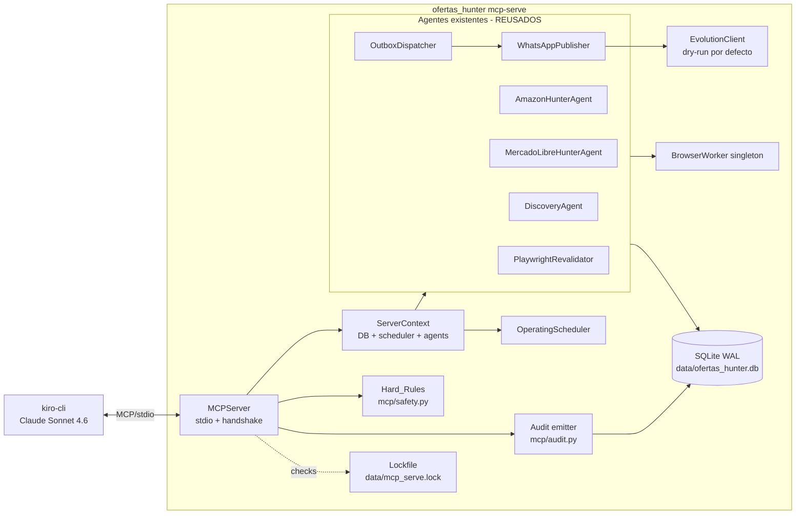
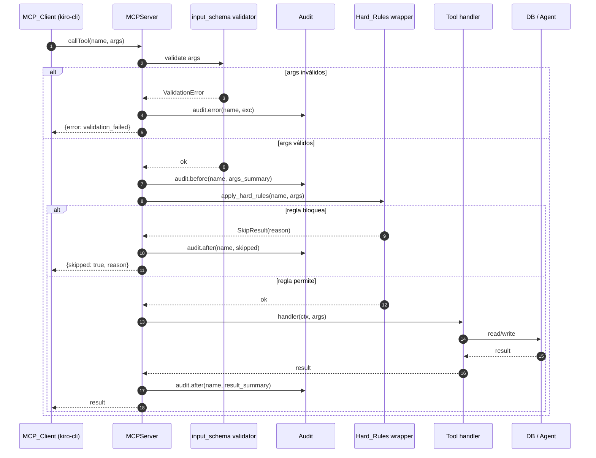

# Design Document

## Overview

Esta feature integra `kiro-cli` (Claude Sonnet 4.6) como orquestador externo del bot `ofertas_hunter` exponiendo un servidor MCP (Model Context Protocol) sobre stdio mediante un nuevo subcomando `python -m ofertas_hunter mcp-serve`. El servidor reutiliza íntegramente los componentes existentes (orchestrator, agentes, scheduler, watchdog, dispatcher, publisher, DB SQLite) y publica un conjunto cerrado de **12 tools** organizadas en tres familias: lectura, acción y calidad.

El scoring, el parsing y los gates duros (cooldown 5 min, imagen+precio+URL, afiliado ML, modo seguro, autoridad del scheduler, filtro Telegram→ML) permanecen al 100 % en Python y son **inviolables**. El servidor los aplica server-side aunque `kiro-cli` pida saltárselos. El comando `python -m ofertas_hunter run` sigue funcionando intacto como fallback.

Cuatro decisiones de diseño guían la arquitectura:

1. **Reutilización antes que reescritura.** El `MCPServer` no construye agentes nuevos; le inyecta al `ServerContext` los mismos `DiscoveryAgent`, `AmazonHunterAgent`, `MercadoLibreHunterAgent`, `OutboxDispatcher` y `OperatingScheduler` que el orchestrator. El browser worker, la conexión SQLite (modo WAL) y el lock del dispatcher son singletons compartidos.
2. **Hard_Rules en el wrapper, no en el LLM.** Cada tool de acción atraviesa `mcp.safety.apply_hard_rules` antes de delegar. Si una regla aplica, la tool retorna `{"skipped": true, "reason": "..."}` y nunca toca al agente. Los argumentos del cliente nunca pueden hacer override.
3. **Quality gate explícito y de dos pasos.** Las tools `request_offer_review` e `improve_message_copy` no bloquean esperando al LLM. Devuelven contexto + `review_token`. El cliente invoca después una tool gemela (`submit_offer_review` / `submit_message_copy`) con la decisión. Esto evita timeouts y permite que `kiro-cli` invoque otras tools entre medias.
4. **Auditoría de cada llamada.** `mcp.audit.audit_call` emite un `runtime_event(kind="mcp_tool_called")` por invocación, con `args_summary` y `result_summary` truncados y sanitizados (cookies, api keys y tokens removidos). En errores: `severity="error"` con `exception_class`.

## Steering Documents Reviewed

Reglas duras del Bot ya implementadas y que el MCP_Server respeta sin excepción:

- Cooldown global del dispatcher de 5 minutos para ofertas `normal` (`dispatching/cooldown.py`, `dispatching/dispatcher.py`).
- Gate imagen + precio + URL al formatear (`publishing/whatsapp_publisher.py`, `publishing/formatter.py`).
- URL de afiliado de Mercado Libre obligatoria cuando `MERCADOLIBRE_AFFILIATE_REQUIRED_FOR_PUBLISH=true` (`whatsapp_publisher._mercadolibre_affiliate_gate`).
- Modo seguro por defecto: `PUBLISHING_ENABLED=false` y `PUBLISHING_DRY_RUN=true`.
- Decisiones del `OperatingScheduler` (`hibernating | warmup | active`) en `runtime/scheduler.py`.
- Filtro Telegram → Mercado Libre (`telegram_ignore_mercadolibre_links` + `Source != telegram` en items ML).


## Architecture

### Stack y dependencias

- **Lenguaje**: Python 3.11+ (ya en uso por el resto del bot).
- **Librería MCP**: `mcp>=1.0` desde PyPI (paquete oficial publicado por Anthropic, instala el SDK `mcp` con módulo `mcp.server.stdio` y decorador `@server.list_tools()` / `@server.call_tool()`). Se añade a `requirements.txt` y a `pyproject.toml` bajo `dependencies`.
  - Si la librería oficial no estuviera disponible o quedara inestable en una versión futura, el contrato del servidor está aislado en `mcp/server.py` para permitir un fallback a una implementación mínima de JSON-RPC sobre stdio. **No es prioritario implementarlo a mano**; añadir la dependencia es la opción aceptada.
  - **Lazy import**: el `import mcp.server.stdio` vive dentro del cuerpo de `MCPServer.__init__` y de `cmd_mcp_serve`. `python -m ofertas_hunter run`, `dispatch`, `init-db`, `check-config`, etc. **no fallan** si la dependencia falta o se rompe.
- **Transport**: stdio. El cliente arranca el proceso del bot, se comunica por stdin/stdout y los logs van a stderr (`logging_setup.configure_logging(stream=sys.stderr)`).
- **Validación de inputs**: `jsonschema` (ya transitivamente disponible vía `pydantic`). Cada tool publica un `input_schema` JSON-Schema y el dispatcher valida antes de invocar el handler.
- **Concurrencia**: `asyncio` (ya en uso por orchestrator y dispatcher).

### Diagrama de componentes



Los componentes en `Agents` son los **mismos objetos** que crearía `Orchestrator` cuando se ejecuta `python -m ofertas_hunter run`. El `MCPServer` los obtiene de un `AgentFactoryBuilder` configurado con la misma `Settings`.

### Flujo de una llamada MCP



Tres invariantes del flujo:

- La validación del schema ocurre **antes** que cualquier auditoría de éxito. Si validación falla se emite un evento de error con `validation_failed` como exception class.
- `Hard_Rules` se aplica **después** de validar y **antes** del handler. Una regla que rechace produce `{"skipped": true, ...}` (no es un error).
- El handler **nunca** toca la DB sin pasar por el wrapper de seguridad. No se permite que un handler haga `conn.execute()` directo de mutaciones; debe ir por el método del agente correspondiente.

### Lifecycle del proceso `mcp-serve`

```
python -m ofertas_hunter mcp-serve
  → cmd_mcp_serve(args)
    → init_db()
    → settings = get_settings()
    → lockfile.acquire(data/mcp_serve.lock, scope="mcp-serve")
        ↳ si ya hay un mcp-serve o un run, exit 2 con mensaje claro
    → conn = connect()  (SQLite WAL)
    → builder = AgentFactoryBuilder(conn, settings, OrchestratorConfig(...))
    → ctx = ServerContext.from_builder(builder, conn)
    → server = MCPServer(ctx, lockfile)
    → asyncio.run(server.serve_stdio())
       ↳ on signal / EOF de stdin → server.shutdown() → lockfile.release()
```

`server.serve_stdio()` hace:

1. Crea un `mcp.server.Server("ofertas-hunter")`.
2. Registra `@server.list_tools()` que devuelve la lista a partir del `ToolRegistry`.
3. Registra `@server.call_tool()` que delega en `MCPServer.dispatch(name, args)`.
4. Arranca `mcp.server.stdio.stdio_server()` y queda escuchando.

## Components and Interfaces

Todos los módulos nuevos viven en `src/ofertas_hunter/mcp/`. Están estructurados para que el resto del paquete pueda importar tipos sin arrastrar la dependencia `mcp` (las importaciones de `mcp.server.*` están aisladas en `server.py` y `__main__.py`).

```
src/ofertas_hunter/mcp/
├── __init__.py            # exporta MCPServer, ServerContext, ToolSpec
├── server.py              # MCPServer: handshake, registry, dispatch
├── context.py             # ServerContext: DB, scheduler, agentes, locks
├── safety.py              # apply_hard_rules + SkipResult
├── audit.py               # audit_call + sanitize
├── lockfile.py            # FileLock para data/mcp_serve.lock
├── serializers.py         # OutboxItem/Offer/RuntimeEvent → dict JSON-safe
└── tools/
    ├── __init__.py        # build_tool_registry(ctx) → ToolRegistry
    ├── read_tools.py      # 5 read tools
    ├── action_tools.py    # 7 action tools
    └── quality_tools.py   # 4 quality tools (review + submit gemelas)
```

### `mcp/__init__.py`

Re-exporta los tipos públicos:

```python
from .server import MCPServer
from .context import ServerContext
from .tools import ToolSpec, ToolRegistry, build_tool_registry

__all__ = ["MCPServer", "ServerContext", "ToolSpec", "ToolRegistry",
           "build_tool_registry"]
```

### `mcp/server.py` — `MCPServer`

Responsable del handshake, el registro de tools y el dispatch.

```python
class MCPServer:
    def __init__(self, ctx: ServerContext, lockfile: FileLock,
                 *, registry: Optional[ToolRegistry] = None) -> None:
        self.ctx = ctx
        self.lockfile = lockfile
        self.registry = registry or build_tool_registry(ctx)
        # Lazy import: evita exigir la dependencia si nunca se invoca mcp-serve.
        from mcp.server import Server
        from mcp.server.stdio import stdio_server
        self._mcp_server_cls = Server
        self._stdio_server = stdio_server

    async def serve_stdio(self) -> None:
        server = self._mcp_server_cls("ofertas-hunter")

        @server.list_tools()
        async def _list() -> list[ToolDescriptor]:
            return [t.descriptor() for t in self.registry.values()]

        @server.call_tool()
        async def _call(name: str, args: dict) -> list[ContentBlock]:
            result = await self.dispatch(name, args)
            return [TextContent(type="text",
                                text=json.dumps(result, ensure_ascii=False))]

        async with self._stdio_server() as (read, write):
            await server.run(read, write,
                             InitializationOptions(server_name="ofertas-hunter",
                                                   server_version="0.1.0"))

    async def dispatch(self, name: str, args: dict) -> dict:
        spec = self.registry.get(name)
        if spec is None:
            return {"error": "unknown_tool", "tool": name}
        # 1. Validar args contra input_schema
        try:
            jsonschema.validate(args, spec.input_schema)
        except jsonschema.ValidationError as exc:
            await audit.audit_error(self.ctx, name, args, exc)
            return {"error": "validation_failed", "detail": exc.message}
        # 2. Audit before
        await audit.audit_before(self.ctx, name, args)
        # 3. Hard rules (sólo para tools no read-only o para action/quality)
        if not spec.is_read_only:
            check = await safety.apply_hard_rules(self.ctx, spec, args)
            if check.skipped:
                await audit.audit_after(self.ctx, name,
                                        {"skipped": True, "reason": check.reason})
                return {"skipped": True, "reason": check.reason}
        # 4. Handler
        try:
            result = await spec.handler(self.ctx, args)
        except Exception as exc:
            await audit.audit_error(self.ctx, name, args, exc)
            return {"error": "handler_failed",
                    "exception_class": type(exc).__name__}
        # 5. Audit after
        await audit.audit_after(self.ctx, name, result)
        return result

    async def shutdown(self) -> None:
        await self.ctx.aclose()
        self.lockfile.release()
```

### `mcp/context.py` — `ServerContext`

Encapsula recursos compartidos entre handlers.

```python
@dataclass
class ServerContext:
    db: sqlite3.Connection                  # singleton, modo WAL, ya inicializada
    settings: Settings
    scheduler: OperatingScheduler           # autoridad para hibernating/warmup/active
    builder: AgentFactoryBuilder            # NO se usa para crear nuevas factories;
                                            # se usa para acceder a agentes y reusarlos
    # Agentes (lazy: se construyen en el primer uso y se cachean)
    discovery_amazon: Optional[DiscoveryAgent] = None
    discovery_ml: Optional[DiscoveryAgent] = None
    amazon_hunter: Optional[AmazonHunterAgent] = None
    ml_hunter: Optional[MercadoLibreHunterAgent] = None
    dispatcher: Optional[OutboxDispatcher] = None
    revalidator: Optional[PlaywrightRevalidator] = None
    publisher: Optional[WhatsAppPublisher] = None
    browser: Optional[BrowserWorker] = None  # singleton
    evolution_client: Optional[EvolutionClient] = None

    # Locks de concurrencia
    marketplace_locks: dict[str, asyncio.Lock] = field(default_factory=dict)
    dispatcher_lock: asyncio.Lock = field(default_factory=asyncio.Lock)

    # Estado en proceso (no persistente)
    pause_state: dict[str, "PauseInfo"] = field(default_factory=dict)
    review_tokens: dict[str, "ReviewSession"] = field(default_factory=dict)

    @classmethod
    def from_builder(cls, builder: AgentFactoryBuilder,
                      conn: sqlite3.Connection) -> "ServerContext":
        ctx = cls(db=conn, settings=builder.settings,
                  scheduler=builder.scheduler, builder=builder)
        return ctx

    async def get_amazon_hunter(self) -> AmazonHunterAgent: ...
    async def get_ml_hunter(self) -> MercadoLibreHunterAgent: ...
    async def get_dispatcher(self) -> OutboxDispatcher: ...
    async def get_revalidator(self) -> PlaywrightRevalidator: ...
    async def aclose(self) -> None: ...

    def lock_for(self, marketplace: str) -> asyncio.Lock:
        return self.marketplace_locks.setdefault(marketplace, asyncio.Lock())
```

Notas sobre reutilización (Requirement 3.6):

- El `ServerContext` se construye con el mismo `AgentFactoryBuilder` que usa `Orchestrator`. Las getters cachean la primera instancia; subsiguientes llamadas retornan exactamente el mismo objeto (verificable con `is`).
- `BrowserWorker` se inicializa **una sola vez** y se comparte entre `discovery_amazon`, `discovery_ml`, `amazon_hunter`, `ml_hunter` y `revalidator`. El `__aenter__` se llama en el primer uso.
- `EvolutionClient` y `WhatsAppPublisher` son singletons. El `OutboxDispatcher` también lo es (un solo `asyncio.Lock` global por proceso).
- El `OperatingScheduler` es el mismo objeto que vería `Orchestrator`, configurado con la misma `ScheduleConfig` derivada de `Settings`.
- `OrchestratorConfig` se construye igual que en `cmd_run` (defaults + seeds desde `config/seeds/*.json`). Esto preserva Requirement 8.2.

### `mcp/safety.py` — Hard_Rules wrapper

Aplica gates antes de delegar a un handler de mutación.

```python
@dataclass
class SkipResult:
    skipped: bool
    reason: Optional[str] = None
    detail: Optional[dict] = None

OK = SkipResult(skipped=False)


async def apply_hard_rules(ctx: ServerContext, spec: ToolSpec,
                            args: dict) -> SkipResult:
    """Aplica TODAS las reglas relevantes para esta tool. Devuelve la primera
    que rechaza, o OK si todas pasan."""
    for rule_name in spec.safety_rules:
        rule = _RULES[rule_name]
        result = await rule(ctx, args)
        if result.skipped:
            return result
    return OK


# Reglas individuales (todas async para uniformidad):

async def rule_schedule_authority(ctx, args) -> SkipResult:
    """Si el scheduler no es ACTIVE para esta operación, skip."""
    decision = ctx.scheduler.decide()
    if decision.mode != ScheduleMode.ACTIVE:
        return SkipResult(skipped=True, reason=decision.mode.value)
    return OK

async def rule_marketplace_paused(ctx, args) -> SkipResult:
    name = args.get("marketplace") or _infer_marketplace(args)
    if name and name in ctx.pause_state and ctx.pause_state[name].active:
        return SkipResult(skipped=True, reason="paused",
                          detail={"marketplace": name,
                                  "until": ctx.pause_state[name].until_iso})
    return OK

async def rule_cooldown_normal(ctx, args) -> SkipResult:
    """Sólo bloquea publicaciones de tipo normal antes de 5 min."""
    dispatcher = await ctx.get_dispatcher()
    last = dispatcher._last_normal_publication_at  # noqa: SLF001
    if last is None:
        return OK
    delta = (datetime.now(tz=timezone.utc) - last).total_seconds()
    if delta < ctx.settings.whatsapp_cooldown_seconds:
        return SkipResult(skipped=True, reason="cooldown_active",
                          detail={"remaining_seconds":
                                  ctx.settings.whatsapp_cooldown_seconds - int(delta)})
    return OK

async def rule_publishing_safe_mode(ctx, args) -> SkipResult:
    """En modo seguro NO bloqueamos: el dispatcher devuelve dry_run=true por
    sí mismo. Pero el wrapper marca el resultado para que el cliente lo sepa."""
    return OK  # informativo, el publisher ya respeta los flags

async def rule_image_price_url(ctx, args) -> SkipResult:
    """Para tools que tocan un OutboxItem específico, validar que el payload
    tenga image_url, current_price, url. Devuelve detalle del campo faltante."""
    outbox_id = args.get("outbox_id")
    if outbox_id is None:
        return OK
    item = _load_outbox_item(ctx.db, outbox_id)
    if item is None:
        return OK  # error real lo lanza el handler
    payload = item.message_payload or {}
    for key in ("image_url", "current_price", "url"):
        if not payload.get(key) and key != "url":
            return SkipResult(skipped=True, reason=f"missing_{key}")
    if not (payload.get("affiliate_url") or payload.get("url")):
        return SkipResult(skipped=True, reason="missing_url")
    return OK

async def rule_ml_affiliate(ctx, args) -> SkipResult:
    if not ctx.settings.mercadolibre_affiliate_required_for_publish:
        return OK
    outbox_id = args.get("outbox_id")
    if outbox_id is None:
        return OK
    item = _load_outbox_item(ctx.db, outbox_id)
    if item is None:
        return OK
    payload = item.message_payload or {}
    if (payload.get("marketplace") or "").lower() != "mercadolibre":
        return OK
    if not payload.get("affiliate_url"):
        return SkipResult(skipped=True, reason="missing_affiliate_url")
    return OK

async def rule_telegram_to_ml(ctx, args) -> SkipResult:
    """Items ML cuya source es 'telegram' nunca se publican."""
    outbox_id = args.get("outbox_id")
    if outbox_id is None:
        return OK
    item = _load_outbox_item(ctx.db, outbox_id)
    if item is None:
        return OK
    payload = item.message_payload or {}
    if ((payload.get("marketplace") or "").lower() == "mercadolibre"
            and (payload.get("source") or "").lower() == "telegram"):
        return SkipResult(skipped=True, reason="telegram_to_ml_blocked")
    return OK


_RULES = {
    "schedule_authority": rule_schedule_authority,
    "marketplace_paused": rule_marketplace_paused,
    "cooldown_normal": rule_cooldown_normal,
    "publishing_safe_mode": rule_publishing_safe_mode,
    "image_price_url": rule_image_price_url,
    "ml_affiliate": rule_ml_affiliate,
    "telegram_to_ml": rule_telegram_to_ml,
}
```

Cada `ToolSpec` declara su lista de reglas en `safety_rules`. El cliente **no** puede inyectar argumentos para saltarse ninguna: el wrapper ignora cualquier campo que no esté en `input_schema` (jsonschema con `additionalProperties: false`), y aunque coincidiera en nombre, el wrapper no consulta args para decidir si aplicar una regla.

### `mcp/audit.py` — Auditoría sanitizada

```python
_SECRET_KEYS = {"cookies", "cookie", "api_key", "apikey", "anthropic_api_key",
                "evolution_api_key", "telegram_api_hash", "session_string",
                "token", "access_token", "refresh_token", "authorization",
                "bearer", "password"}

_MAX_STRING_LEN = 500

def sanitize(value: Any) -> Any:
    if isinstance(value, dict):
        return {k: ("[redacted]" if k.lower() in _SECRET_KEYS else sanitize(v))
                for k, v in value.items()}
    if isinstance(value, list):
        return [sanitize(v) for v in value]
    if isinstance(value, str) and len(value) > _MAX_STRING_LEN:
        return value[:_MAX_STRING_LEN] + f"...[+{len(value) - _MAX_STRING_LEN}]"
    return value

async def audit_before(ctx: ServerContext, tool: str, args: dict) -> None:
    emit_runtime_event(
        ctx.db,
        kind="mcp_tool_called",
        severity="info",
        payload={"phase": "before", "tool": tool,
                 "args_summary": sanitize(args)},
    )

async def audit_after(ctx: ServerContext, tool: str, result: Any) -> None:
    emit_runtime_event(
        ctx.db,
        kind="mcp_tool_called",
        severity="info",
        payload={"phase": "after", "tool": tool,
                 "result_summary": sanitize(result)},
    )

async def audit_error(ctx: ServerContext, tool: str, args: dict,
                      exc: Exception) -> None:
    emit_runtime_event(
        ctx.db,
        kind="mcp_tool_called",
        severity="error",
        payload={"phase": "error", "tool": tool,
                 "args_summary": sanitize(args),
                 "exception_class": type(exc).__name__,
                 "exception_message": str(exc)[:_MAX_STRING_LEN]},
    )
```

Cada llamada produce **al menos un** evento (siempre `before`) y exactamente un evento de cierre (`after` en éxito o skip, `error` en excepción). Dos eventos por llamada en el camino feliz.

### `mcp/lockfile.py` — File lock para detectar concurrencia

```python
class FileLock:
    """Lock cooperativo en disco. Detecta arranques concurrentes de
    `python -m ofertas_hunter run` y `python -m ofertas_hunter mcp-serve`
    contra la misma DB.

    Implementación: escribe pid + scope en `data/mcp_serve.lock`. Antes de
    crear el archivo, verifica si existe otro:
      - Si existe y el pid responde a OS.kill(pid, 0) → conflicto, exit 2.
      - Si existe pero el pid ya no vive → stale lock, lo sobreescribe.

    El comando `run` también adquiere el mismo lockfile con scope="run" para
    que la detección sea bidireccional.
    """

    def __init__(self, path: Path, *, scope: str) -> None: ...
    def acquire(self) -> None: ...     # exit 2 con mensaje en conflicto
    def release(self) -> None: ...
    @staticmethod
    def is_held() -> Optional[dict]: ...  # útil para get_status
```

`cmd_run` también llama a `FileLock(path, scope="run").acquire()` al inicio. Esto satisface Requirement 8.3 sin cambiar su comportamiento exitoso (single instance). El flag `--no-lock` en `cmd_mcp_serve` permite saltarse el lockfile **sólo** para tests in-process.

### `mcp/serializers.py` — Conversión a dicts JSON-safe

Funciones puras que convierten modelos del bot a payloads serializables:

```python
def serialize_outbox_item(item: OutboxItem) -> dict:
    return {
        "id": item.id,
        "offer_id": item.offer_id,
        "type": item.type,
        "state": item.state,
        "enqueued_at": _iso(item.enqueued_at),
        "scheduled_for": _iso(item.scheduled_for) if item.scheduled_for else None,
        "attempts": item.attempts,
        "last_attempt_at": _iso(item.last_attempt_at) if item.last_attempt_at else None,
        "payload": item.message_payload,
    }

def serialize_offer(row: sqlite3.Row) -> dict: ...
def serialize_runtime_event(row: sqlite3.Row) -> dict: ...
def serialize_schedule_decision(d: ModeDecision) -> dict: ...
def serialize_publish_outcome(o: PublishOutcome) -> dict: ...
def serialize_revalidation(detail: RevalidationDetail) -> dict: ...
```

Todos los `datetime` salen como ISO 8601 UTC con sufijo `Z`. `Decimal` y floats se convierten a `float` planos. `Enum` se convierte a su `.value`.

## Subcomando CLI

Se añade `cmd_mcp_serve` en `src/ofertas_hunter/__main__.py`.

```python
def cmd_mcp_serve(args: argparse.Namespace) -> int:
    s = get_settings()
    init_db()

    # Resolver lockfile (exit 2 si run/mcp-serve simultáneos).
    lock = FileLock(s.db_path_resolved.parent / "mcp_serve.lock", scope="mcp-serve")
    if not args.no_lock:
        try:
            lock.acquire()
        except FileLock.Conflict as exc:
            print(f"ERROR: ya hay una instancia activa: {exc}", file=sys.stderr)
            return 2

    # Reusar la misma máquina que cmd_run.
    config = OrchestratorConfig(
        once=False,
        amazon_seeds=load_amazon_seeds(s),
        mercadolibre_seeds=load_mercadolibre_seeds(s),
        amazon_hunt_limit=5,
        mercadolibre_hunt_limit=5,
        schedule_enabled=s.schedule_enabled,
        schedule_timezone=s.schedule_timezone,
        hibernate_start=s.hibernate_start,
        hibernate_end=s.hibernate_end,
        warmup_start=s.warmup_start,
        active_start=s.active_start,
    )
    conn = connect()

    async def _run():
        try:
            from .mcp import MCPServer, ServerContext
            builder = AgentFactoryBuilder(conn, settings=s, config=config)
            ctx = ServerContext.from_builder(builder, conn)
            server = MCPServer(ctx, lockfile=lock)
            await server.serve_stdio()
        finally:
            try:
                lock.release()
            except Exception:
                pass
            conn.close()

    try:
        asyncio.run(_run())
    except KeyboardInterrupt:
        logger.info("mcp-serve interrumpido por usuario")
    return 0
```

Y el subparser:

```python
mcp_p = sub.add_parser("mcp-serve",
                        help="Arranca el servidor MCP por stdio para kiro-cli")
mcp_p.add_argument("--no-lock", action="store_true",
                   help="No tomar el lockfile (sólo tests in-process)")
mcp_p.add_argument("--log-level", default=None,
                   help="Override de LOG_LEVEL para esta invocación")
mcp_p.set_defaults(func=cmd_mcp_serve)
```

## Tool registry y contracts

### `ToolSpec` y `ToolRegistry`

```python
@dataclass(frozen=True)
class ToolSpec:
    name: str
    description: str
    input_schema: dict                 # JSON-Schema (Draft 7+)
    handler: Callable[[ServerContext, dict], Awaitable[dict]]
    is_read_only: bool = False
    requires_active_schedule: bool = False
    safety_rules: tuple[str, ...] = ()  # nombres registrados en _RULES

    def descriptor(self) -> "mcp.types.Tool":
        from mcp.types import Tool
        return Tool(name=self.name,
                    description=self.description,
                    inputSchema=self.input_schema)


ToolRegistry = dict[str, ToolSpec]


def build_tool_registry(ctx: ServerContext) -> ToolRegistry:
    specs: list[ToolSpec] = []
    specs += build_read_tools(ctx)
    specs += build_action_tools(ctx)
    specs += build_quality_tools(ctx)
    return {s.name: s for s in specs}
```

Cada subgrupo de tools vive en su propio archivo, exporta una `build_*_tools(ctx)` y define los handlers.

### Contrato común para resultados

Toda tool devuelve un `dict` con una de estas formas:

| Caso | Forma del resultado |
|------|---------------------|
| Éxito read | `{"data": ..., "meta": {...}}` |
| Éxito action | `{"success": true, ...result_específico}` |
| Skip por hard rule | `{"skipped": true, "reason": "<token>", "detail": {...}}` |
| Validación inválida | `{"error": "validation_failed", "detail": "..."}` |
| Excepción de handler | `{"error": "handler_failed", "exception_class": "..."}` |
| Tool desconocida | `{"error": "unknown_tool", "tool": "..."}` |

`reason` es siempre un token estable (snake_case): `hibernating`, `warmup`, `paused`, `cooldown_active`, `missing_image_url`, `missing_current_price`, `missing_url`, `missing_affiliate_url`, `telegram_to_ml_blocked`, `validation_failed`.

## Tools (12 totales + 2 gemelas de quality)

### Read tools (`mcp/tools/read_tools.py`)

Todas con `is_read_only=True` y `safety_rules=()`. Ninguna escribe en DB.

#### `get_status`

- **Description**: "Devuelve el modo del scheduler, los flags de publicación y los agentes registrados."
- **Input schema**: `{"type": "object", "properties": {}, "additionalProperties": false}`.
- **Handler**:
  ```python
  return {
      "schedule_mode": ctx.scheduler.decide().mode.value,
      "publishing_enabled": ctx.settings.publishing_enabled,
      "publishing_dry_run": ctx.settings.publishing_dry_run,
      "agents_registered": ["amazon_hunter", "mercadolibre_hunter",
                             "outbox_dispatcher", "telegram_listener", "maintenance"],
      "marketplace_paused": {k: v.until_iso for k, v in ctx.pause_state.items() if v.active},
  }
  ```

#### `get_outbox(limit, type_filter)`

- **Description**: "Devuelve los OutboxItems más recientes filtrados por tipo."
- **Input schema**:
  ```json
  {
    "type": "object",
    "properties": {
      "limit": {"type": "integer", "minimum": 1, "maximum": 100, "default": 20},
      "type_filter": {"type": "string", "enum": ["normal", "price_error", "possible_pe", "any"], "default": "any"}
    },
    "additionalProperties": false
  }
  ```
- **Handler**: `SELECT ... FROM outbox WHERE (?='any' OR type=?) ORDER BY enqueued_at DESC LIMIT ?` y serializa con `serialize_outbox_item`.

#### `get_recent_events(limit, severity)`

- **Input schema**:
  ```json
  {
    "type": "object",
    "properties": {
      "limit": {"type": "integer", "minimum": 1, "maximum": 200, "default": 50},
      "severity": {"type": "string", "enum": ["info", "warning", "error", "critical", "any"], "default": "any"}
    },
    "additionalProperties": false
  }
  ```
- **Handler**: query a `runtime_events`, ordenado desc por `created_at`, sanitizado con `serialize_runtime_event`.

#### `get_frontier_stats(marketplace)`

- **Input schema**: `marketplace: enum["amazon", "mercadolibre"]` requerido.
- **Handler**:
  ```python
  rows = ctx.db.execute(
      "SELECT kind, COUNT(*) AS n FROM frontier WHERE marketplace=? GROUP BY kind",
      (args["marketplace"],)
  ).fetchall()
  return {"marketplace": args["marketplace"],
          "by_kind": {r["kind"]: r["n"] for r in rows},
          "total": sum(r["n"] for r in rows)}
  ```

#### `get_schedule_mode`

- **Input schema**: vacío.
- **Handler**:
  ```python
  decision = ctx.scheduler.decide()
  return {
      "mode": decision.mode.value,
      "next_mode": decision.next_mode.value,
      "next_change_in_seconds": int(decision.next_change_in.total_seconds()),
      "local_time": decision.local_time.isoformat(),
  }
  ```

### Action tools (`mcp/tools/action_tools.py`)

Todas mutan estado. Las primeras cuatro chequean `Schedule_Authority` antes de delegar.

#### `discover_seeds(marketplace, limit)`

- **Safety rules**: `("schedule_authority", "marketplace_paused")`.
- **Handler**: toma el `DiscoveryAgent` cacheado para ese marketplace, llama a `discover_once()` con `max_per_cycle = min(limit, 10)`, devuelve resumen `{"discovered": N, "persisted": M, "outcomes": [...]}`.
- Bajo el `marketplace_locks[marketplace]` para evitar dos discovery concurrentes en el mismo MP.

#### `hunt_amazon(limit)`

- **Safety rules**: `("schedule_authority", "marketplace_paused")` con `marketplace="amazon"` inferido.
- **Handler**:
  ```python
  async with ctx.lock_for("amazon"):
      hunter = await ctx.get_amazon_hunter()
      outcomes = await hunter.hunt_from_frontier(max_urls=args["limit"])
      return {"success": True,
              "processed": len(outcomes),
              "enqueued": sum(1 for o in outcomes if o.enqueued_outbox_id),
              "discarded": sum(1 for o in outcomes if o.discarded_reason),
              "outcomes": [_summarize_outcome(o) for o in outcomes]}
  ```

#### `hunt_mercadolibre(limit)`

- **Safety rules**: `("schedule_authority", "marketplace_paused")` con `marketplace="mercadolibre"`.
- **Handler**: análogo a `hunt_amazon` pero con `MercadoLibreHunterAgent`. Si el hunter está pausado por `cookie_expiry`, devuelve `{"skipped": true, "reason": "ml_paused_for_login"}`.

#### `dispatch_outbox(limit)`

- **Safety rules**: `("schedule_authority",)` (warmup también bloquea publicación, igual que el dispatcher real).
- **Handler**:
  ```python
  async with ctx.dispatcher_lock:
      dispatcher = await ctx.get_dispatcher()
      results = []
      for _ in range(min(args["limit"], 10)):
          outcome = await dispatcher.tick()
          if outcome is None:
              break
          results.append(serialize_publish_outcome(outcome))
      return {"success": True, "ticks": len(results), "results": results}
  ```

#### `revalidate_offer(outbox_id)`

- **Safety rules**: `()` (la revalidación lee y persiste un snapshot, no publica).
- **Handler**: carga el item, ejecuta `PlaywrightRevalidator.revalidate_detailed`, devuelve `{success, classification, confidence_label, fatal_reason, extracted}`.

#### `pause_marketplace(name, reason, ttl_seconds)`

- **Input schema**: `name` enum requerido, `reason` string ≤200 chars requerido, `ttl_seconds` int 0..86400 (default 0 = sin TTL, hasta `unpause`).
- **Safety rules**: `()` (es una operación de control, no toca DB de productos).
- **Handler**:
  ```python
  ttl = args.get("ttl_seconds", 0)
  until = (datetime.now(tz=timezone.utc) + timedelta(seconds=ttl)
           if ttl > 0 else None)
  ctx.pause_state[name] = PauseInfo(active=True, reason=args["reason"],
                                     until=until,
                                     timer=None)
  if ttl > 0:
      loop = asyncio.get_running_loop()
      timer = loop.call_later(ttl, lambda: _clear_pause(ctx, name))
      ctx.pause_state[name].timer = timer
  return {"success": True, "marketplace": name,
          "until": _iso(until) if until else None}
  ```

#### `unpause_marketplace(name)`

- **Handler**:
  ```python
  info = ctx.pause_state.pop(name, None)
  if info and info.timer:
      info.timer.cancel()
  return {"success": True, "marketplace": name, "was_paused": info is not None}
  ```

### Quality tools (`mcp/tools/quality_tools.py`)

Las quality tools son **de dos pasos** para evitar bloqueo: el cliente invoca una tool de "request" que devuelve contexto + `review_token`, decide qué hacer (apoyándose en otras tools si lo necesita), y luego invoca la gemela "submit" con el token y la decisión.

`ReviewSession` se mantiene en memoria (`ctx.review_tokens: dict[str, ReviewSession]`):

```python
@dataclass
class ReviewSession:
    token: str                         # uuid4
    outbox_id: int
    kind: str                          # "offer_review" | "message_copy"
    snapshot_payload: dict             # copia inmutable del payload original
    created_at: datetime
    expires_at: datetime               # created_at + 10 min
```

#### `request_offer_review(outbox_id)`

- **Safety rules**: `("image_price_url", "ml_affiliate", "telegram_to_ml")`. Si falla un gate, no se crea sesión; se devuelve skip.
- **Handler**:
  ```python
  item = _load_outbox_item(ctx.db, args["outbox_id"])
  if item is None:
      return {"error": "outbox_not_found", "outbox_id": args["outbox_id"]}
  formatted = _preview_message(item)   # usa formatter con dry-run
  token = uuid4().hex
  ctx.review_tokens[token] = ReviewSession(
      token=token, outbox_id=item.id, kind="offer_review",
      snapshot_payload=copy.deepcopy(item.message_payload),
      created_at=now_utc(), expires_at=now_utc() + timedelta(minutes=10),
  )
  return {
      "review_token": token,
      "expires_at": _iso(ctx.review_tokens[token].expires_at),
      "outbox": serialize_outbox_item(item),
      "formatted_preview": {"text": formatted.text, "image_url": formatted.image_url,
                             "type": formatted.type},
  }
  ```

#### `submit_offer_review(outbox_id, review_token, decision, reason?, new_text?)`

- **Input schema**:
  ```json
  {
    "type": "object",
    "properties": {
      "outbox_id": {"type": "integer", "minimum": 1},
      "review_token": {"type": "string"},
      "decision": {"type": "string", "enum": ["approve", "reject", "rewrite_message"]},
      "reason": {"type": "string", "maxLength": 500},
      "new_text": {"type": "string", "maxLength": 4000}
    },
    "required": ["outbox_id", "review_token", "decision"],
    "additionalProperties": false
  }
  ```
- **Safety rules**: `()` (las reglas ya se aplicaron al request; aquí sólo aplicamos la regla de preservación de campos en el handler).
- **Handler**:
  ```python
  session = ctx.review_tokens.get(args["review_token"])
  if session is None or session.expires_at < now_utc():
      return {"error": "invalid_or_expired_token"}
  if session.outbox_id != args["outbox_id"]:
      return {"error": "token_mismatch"}

  decision = args["decision"]
  if decision == "approve":
      _mark_eligible(ctx.db, args["outbox_id"])  # state=pending, no mutación payload
      return {"success": True, "decision": "approve",
              "outbox_id": args["outbox_id"]}
  if decision == "reject":
      reason = args.get("reason") or "rejected_by_review"
      _mark_discarded(ctx.db, args["outbox_id"], reason=f"mcp_review:{reason}")
      return {"success": True, "decision": "reject",
              "outbox_id": args["outbox_id"], "reason": reason}
  if decision == "rewrite_message":
      new_text = args.get("new_text")
      if not new_text:
          return {"error": "missing_new_text"}
      _apply_rewrite(ctx.db, args["outbox_id"], session.snapshot_payload, new_text)
      return {"success": True, "decision": "rewrite_message",
              "outbox_id": args["outbox_id"]}
  ```
- `_apply_rewrite` actualiza **únicamente** `payload["caption_override"] = new_text` y deja intactos `image_url`, `url`, `affiliate_url`, `current_price`, `previous_price`, `discount_percent`, `marketplace`, `confidence_label`, `score`, `score_classification`. Esto satisface el invariante 4.5/5.2 incluso si el cliente envía un payload completo.
- El formatter del publisher se modifica para preferir `payload["caption_override"]` cuando está presente; si no, formatea normal.

#### `improve_message_copy(outbox_id, current_text)`

- **Safety rules**: `("image_price_url", "ml_affiliate", "telegram_to_ml")`. Si los gates fallan, no se permite reescribir (Requirement 5.3).
- **Handler**: similar a `request_offer_review` pero con `kind="message_copy"`. Devuelve `review_token`, payload, y el `current_text` provisto por el cliente como referencia.

#### `submit_message_copy(outbox_id, review_token, new_text)`

- **Handler**: aplica el rewrite igual que `submit_offer_review(decision="rewrite_message")`. Es una operación pura sobre `caption_override`.

### Resumen del registro

```python
TOOL_NAMES = [
    # read (5)
    "get_status", "get_outbox", "get_recent_events", "get_frontier_stats",
    "get_schedule_mode",
    # action (7)
    "discover_seeds", "hunt_amazon", "hunt_mercadolibre", "dispatch_outbox",
    "revalidate_offer", "pause_marketplace", "unpause_marketplace",
    # quality (4: 2 request + 2 submit)
    "request_offer_review", "submit_offer_review",
    "improve_message_copy", "submit_message_copy",
]
```

## Concurrency model

Tres niveles de coordinación:

1. **Locks por marketplace** (`asyncio.Lock`): un solo hunt o discovery por marketplace a la vez. `discover_seeds` y `hunt_<marketplace>` comparten el mismo lock para que no se solapen.
2. **Lock global del dispatcher**: `dispatch_outbox` obtiene `ctx.dispatcher_lock` antes de llamar a `dispatcher.tick()`. Esto reproduce el comportamiento "estrictamente serializado" del dispatcher real.
3. **Lockfile en disco** (`data/mcp_serve.lock`): detecta arranques simultáneos de `run` y `mcp-serve`. Inspeccionable vía `get_status` (campo `lock_holder`).

Política de paralelismo:

- **Read tools** son seguras de invocar en paralelo. No requieren lock.
- **Action tools** se serializan por marketplace. Diferentes marketplaces pueden ejecutar acciones concurrentemente (Amazon hunt + ML discover). El dispatcher es global serializado.
- **Quality tools** no requieren lock: las modificaciones a `outbox` van por SQLite con `BEGIN IMMEDIATE` implícito de `connection().execute()`.

## Data Models

### Cambios en modelos existentes

- `OutboxItem.message_payload` admite ahora una clave opcional `caption_override: str`. El `WhatsAppPublisher` y el `formatter` la respetan: si está presente, se usa como texto del mensaje; si no, se formatea con el template normal/price_error existente. Esto centraliza el efecto de `rewrite_message` y `improve_message_copy` sin alterar otros campos.

### Nuevos modelos en `mcp/`

```python
@dataclass
class PauseInfo:
    active: bool
    reason: str
    until: Optional[datetime]              # None = sin TTL
    timer: Optional[asyncio.TimerHandle]   # call_later del cleanup

    @property
    def until_iso(self) -> Optional[str]: ...


@dataclass
class ReviewSession:
    token: str
    outbox_id: int
    kind: str                              # "offer_review" | "message_copy"
    snapshot_payload: dict
    created_at: datetime
    expires_at: datetime
```

### Tabla `runtime_events` (existente)

Eventos nuevos emitidos por esta feature:

| `kind` | `severity` | `payload` |
|--------|-----------|-----------|
| `mcp_tool_called` | `info` | `{phase: "before", tool, args_summary}` |
| `mcp_tool_called` | `info` | `{phase: "after", tool, result_summary}` |
| `mcp_tool_called` | `error` | `{phase: "error", tool, args_summary, exception_class, exception_message}` |
| `mcp_marketplace_paused` | `warning` | `{marketplace, reason, ttl_seconds, until}` |
| `mcp_marketplace_unpaused` | `info` | `{marketplace}` |
| `mcp_offer_reviewed` | `info` | `{outbox_id, decision, token, reason?}` |

No se introducen tablas nuevas. La sesión de review es estado en memoria con TTL de 10 minutos.

## Error Handling

### Estrategia general

- Ninguna excepción del handler escapa al transport MCP. `MCPServer.dispatch` la convierte en `{"error": "handler_failed", "exception_class": ...}` y la audita con `severity="error"`.
- Los errores **esperados** (validation, item no encontrado, gate fallido) no son excepciones: son resultados estructurados con `error` o `skipped`.
- Los errores **inesperados** (Playwright muerto, conexión SQLite caída) se loguean con stack trace en stderr y se reportan al cliente sin filtrar paths internos.

### Tabla de casos

| Situación | Resultado al cliente | Audit severity |
|-----------|---------------------|----------------|
| Tool desconocida | `{"error": "unknown_tool", "tool": <name>}` | error |
| Args fuera de schema | `{"error": "validation_failed", "detail": <msg>}` | error |
| Hard rule rechaza | `{"skipped": true, "reason": <token>}` | info |
| Item no encontrado | `{"error": "outbox_not_found", "outbox_id": <id>}` | error |
| Token de review inválido | `{"error": "invalid_or_expired_token"}` | error |
| Excepción en handler | `{"error": "handler_failed", "exception_class": <cls>}` | error |
| Marketplace pausado | `{"skipped": true, "reason": "paused", "detail": {marketplace, until}}` | info |
| Schedule no activo | `{"skipped": true, "reason": "hibernating"\|"warmup"}` | info |
| Cooldown activo | `{"skipped": true, "reason": "cooldown_active", "detail": {remaining_seconds}}` | info |
| ML sin afiliado | `{"skipped": true, "reason": "missing_affiliate_url"}` | info |
| Sin imagen/precio/url | `{"skipped": true, "reason": "missing_<field>"}` | info |
| Telegram→ML | `{"skipped": true, "reason": "telegram_to_ml_blocked"}` | info |
| Lockfile en conflicto | exit 2 desde `cmd_mcp_serve` antes de iniciar el server | n/a |

### Recuperación

- Una `Exception` en un handler **no** tira el servidor. El loop sigue atendiendo invocaciones.
- Si `BrowserWorker` muere (Playwright crashea), las siguientes tools de hunt se reportarán como `handler_failed` hasta que se reinicie. Hay un hook en `ServerContext._ensure_browser` que recrea el worker si `browser._browser` está cerrado.
- Si la conexión SQLite se pierde, el handler retorna `handler_failed` y `cmd_mcp_serve` cierra todo limpiamente al recibir el siguiente `KeyboardInterrupt` / EOF.

## Testing Strategy

### Tests planificados (sólo enumeración, no implementación aquí)

Unitarios y de integración:

- `tests/unit/mcp/test_handshake_announces_tools.py` — verifica que `list_tools` devuelve los 12 nombres canónicos.
- `tests/unit/mcp/test_get_status_is_read_only.py` — invoca read tools y compara dump SQL antes/después.
- `tests/unit/mcp/test_hunt_amazon_skipped_during_hibernation.py` — inyecta scheduler con clock controlado en hibernating, verifica skip y que el agente nunca se llamó.
- `tests/unit/mcp/test_dispatch_outbox_respects_cooldown.py` — secuencia de publicaciones normales con clock controlado.
- `tests/unit/mcp/test_dispatch_outbox_blocks_ml_without_affiliate.py` — items ML sin `affiliate_url` skip con razón correcta.
- `tests/unit/mcp/test_request_offer_review_workflow.py` — request → submit con cada decisión válida; verifica preservación de campos materiales en `rewrite_message`.
- `tests/unit/mcp/test_improve_message_copy_preserves_url_and_price.py` — invariante de campos materiales.
- `tests/unit/mcp/test_audit_emits_runtime_event_with_sanitized_payload.py` — payloads con cookies, api_keys y strings >500 → eventos sanitizados.
- `tests/unit/mcp/test_lockfile_blocks_concurrent_run_and_mcp_serve.py` — crear lockfile manualmente, intentar arrancar mcp-serve, verificar exit 2.
- `tests/unit/mcp/test_pause_marketplace_clears_after_ttl.py` — TTL controlado por `loop.call_later` mockeable.
- `tests/unit/mcp/test_steering_file_present_with_workspace_scope.py` — frontmatter del archivo de steering.

Smoke / integración:

- `tests/integration/mcp/test_mcp_smoke_in_process_client.py` — arranca `MCPServer` con cliente MCP en proceso, recorre las 12 tools y verifica el shape de las respuestas.

Mantener verde:

- `tests/` previos (344 tests). Esta feature **no** modifica modelos existentes salvo `WhatsAppPublisher`/`formatter` para respetar `caption_override` (cambio aditivo, default-compatible).

### Property Test Configuration

- Mínimo 100 iteraciones por property test (tag obligatorio: `Feature: kiro-cli-orchestrator, Property N: <text>`).
- Generadores aleatorios para outbox items, runtime_events, payloads con secretos, secuencias de pause/unpause y modos del scheduler.
- Mocks: `EvolutionClient` siempre en dry-run en tests; `BrowserWorker` mockeado por `FakeBrowserWorker`; `OperatingScheduler` con `clock` inyectado.

## Configuración del MCP_Client

El bot incluye `docs/MCP_CLIENT_SETUP.md` con un fragmento de configuración apto para `~/.kiro/settings/mcp.json`:

```json
{
  "mcpServers": {
    "ofertas-hunter": {
      "command": "C:\\Users\\yarteaga\\Desktop\\bot_autonomo_ofert\\ofertas_hunter\\.venv\\Scripts\\python.exe",
      "args": ["-m", "ofertas_hunter", "mcp-serve"],
      "cwd": "C:\\Users\\yarteaga\\Desktop\\bot_autonomo_ofert\\ofertas_hunter",
      "disabled": false,
      "autoApprove": [
        "get_status",
        "get_outbox",
        "get_recent_events",
        "get_frontier_stats",
        "get_schedule_mode"
      ]
    }
  }
}
```

Notas operativas en el doc:

- `command` debe ser el `python.exe` del venv del proyecto, no el del sistema.
- `cwd` debe apuntar a la raíz del repo para que `.env` y `config/seeds/*.json` se resuelvan correctamente.
- `autoApprove` solamente las 5 read tools. Las action y quality tools requieren confirmación explícita del operador.
- En Linux/macOS el `command` es el path al `python` del venv (`./.venv/bin/python`).

## Steering file scoped al workspace

Se crea `.kiro/steering/ofertas-hunter-mcp.md` con frontmatter:

```yaml
---
inclusion: fileMatch
fileMatchPattern: "*"
---
```

Esto fuerza inclusión en todo el workspace pero NO globalmente, satisfaciendo Requirement 9.1.

Estructura de secciones:

1. **Objetivo del bot** — qué publica, dónde, modo seguro por defecto.
2. **Hard_Rules intocables** — referencia explícita a las reglas de Requirement 6 con sus tokens (`cooldown_active`, `missing_image_url`, `missing_current_price`, `missing_url`, `missing_affiliate_url`, `hibernating`, `warmup`, `paused`, `telegram_to_ml_blocked`).
3. **Ciclo recomendado** — `get_status` primero → si frontier vacío `discover_seeds` → `hunt_amazon` y/o `hunt_mercadolibre` → `dispatch_outbox` → para borderline `request_offer_review` + `submit_offer_review`.
4. **Cuándo NO insistir** — si la respuesta es `{skipped: hibernating}` o `{skipped: warmup}`, el modelo SHALL esperar al próximo ciclo en vez de reintentar inmediatamente.
5. **Interpretación de runtime_events** — significados de `cookie_expiry`, `captcha`, `agent_paused`, `agent_skipped`, `mcp_tool_called`.
6. **Anti-patterns del legacy `AmazonScrapperIA`** — el modelo SHALL NOT:
   - Pedir una tool por producto (la API es por marketplace, no por URL).
   - Hacer scoring o parsing en el prompt; eso vive en Python.
   - Duplicar la lógica determinista (cooldown, gates) en el LLM.
   - Aceptar argumentos para hacer override de Hard_Rules; esos args son ignorados server-side.

## Anti-Patterns explícitos (decisiones del diseño)

Estas decisiones son intencionales y restrictivas para evitar regresiones.

1. **Una tool por marketplace, no por producto.** No se expondrá nunca una tool tipo `process_url(url)` porque empuja al LLM a iterar producto-por-producto y replicar el `AmazonScrapperIA` legacy. El cliente trabaja a nivel marketplace.
2. **Scoring y parsing son inviolables y server-side.** Las quality tools sólo permiten `approve | reject | rewrite_caption`. **No** se acepta `override_classification`, `override_score`, `force_publish`, ni equivalentes.
3. **Steering NO duplica lógica determinista.** El archivo `.kiro/steering/ofertas-hunter-mcp.md` describe el contrato (qué razones existen, qué hacer al recibirlas) pero **no** describe los umbrales numéricos del scorer ni el formato exacto del cooldown. Esos viven en Python; cualquier cambio en el código es la fuente de verdad.
4. **Hard_Rules no se overridean por argumento.** El input schema usa `additionalProperties: false`. Un cliente que envíe `{"force": true}` recibe `validation_failed`. Aunque el cliente rebuilde la spec local, el wrapper `apply_hard_rules` no consulta args específicos para "decidir si aplicar"; aplica siempre las reglas declaradas.

## Correctness Properties

*A property is a characteristic or behavior that should hold true across all valid executions of a system — essentially, a formal statement about what the system should do. Properties serve as the bridge between human-readable specifications and machine-verifiable correctness guarantees.*

### Property 1: Tool registry shape is stable

For all `MCPServer` instances created with default registry, the result of `list_tools()` is exactly the set of 12 canonical tool names plus the 2 `submit_*` gemelas (14 total), each with a non-empty `description` and an `input_schema` that declares `additionalProperties: false`.

**Validates: Requirements 1.3, 2.1, 2.2, 2.3, 2.4, 2.5, 3.1, 3.3, 3.4, 4.1, 5.1**

### Property 2: Read tools never mutate persistent state

For any sequence of invocations of `get_status`, `get_outbox`, `get_recent_events`, `get_frontier_stats`, `get_schedule_mode` with arbitrary valid arguments, the SQL dump of every persistent table (`outbox`, `offers`, `products`, `frontier`, `published_messages`, `runtime_events` excluding the audit rows added by these calls themselves) is identical before and after the calls.

**Validates: Requirements 2.6**

### Property 3: get_outbox respects filtering invariants

For any populated `outbox` table and any pair `(limit, type_filter)` valid in the input schema, the result of `get_outbox(limit, type_filter)` satisfies: `len(result) <= limit`, every returned item has `type == type_filter` (when `type_filter != "any"`), and the items are ordered by `enqueued_at` descending.

**Validates: Requirements 2.2**

### Property 4: get_recent_events respects severity filter

For any populated `runtime_events` table and any `(limit, severity)`, every returned event has `severity == severity` (when not `"any"`) and `len(result) <= limit`.

**Validates: Requirements 2.3**

### Property 5: get_frontier_stats counts are total

For any populated `frontier` table and any `marketplace`, the sum of counts in `result["by_kind"]` equals `result["total"]` and equals `SELECT COUNT(*) FROM frontier WHERE marketplace = ?`.

**Validates: Requirements 2.4**

### Property 6: Schedule_Authority is final for action tools

For any args sent to `discover_seeds`, `hunt_amazon`, `hunt_mercadolibre`, or `dispatch_outbox` while `OperatingScheduler.decide().mode != ACTIVE`, the response is `{"skipped": true, "reason": <mode>}`, the underlying agent method (`hunt_from_frontier`, `discover_once`, `dispatcher.tick`) is **never** invoked, and no row is added to `outbox`, `published_messages`, or `frontier` aside from audit events.

**Validates: Requirements 3.2, 6.5**

### Property 7: Pause lifecycle is round-trip with TTL cleanup

For any sequence of `pause_marketplace(name, reason, ttl)` and `unpause_marketplace(name)` operations, the in-memory `ctx.pause_state[name].active` is `true` if and only if the most recent operation was a non-expired `pause`. For any `pause(name, ttl > 0)` followed by advancing the event-loop clock by `ttl + epsilon` seconds with no other operation, `pause_state[name].active` becomes `false` automatically.

**Validates: Requirements 3.4, 3.5**

### Property 8: Action tools reuse existing agents (no parallel scrapers)

For any sequence of action-tool invocations within a single `MCPServer` lifetime, `id(ctx.amazon_hunter)`, `id(ctx.ml_hunter)`, `id(ctx.dispatcher)`, `id(ctx.browser)` are stable across calls (singleton invariant) and equal to the instances exposed by `AgentFactoryBuilder` for that same configuration.

**Validates: Requirements 3.6**

### Property 9: Copy edits preserve material fields

For any OutboxItem and any valid `new_text`, after `submit_offer_review(decision="rewrite_message", new_text=...)` or `submit_message_copy(new_text=...)`, the persisted payload satisfies: `image_url`, `url`, `affiliate_url`, `current_price`, `previous_price`, `discount_percent`, `marketplace`, `confidence_label`, `score`, `score_classification` are byte-equal to their values in the snapshot taken at the corresponding `request_*` call.

**Validates: Requirements 4.5, 5.2**

### Property 10: Approve preserves payload exactly

For any OutboxItem, after `submit_offer_review(decision="approve")`, the persisted `message_payload` is byte-equal to its pre-call value.

**Validates: Requirements 4.3**

### Property 11: Reject persists discard reason

For any OutboxItem and any `reason` of length ≤ 500, after `submit_offer_review(decision="reject", reason=R)`, the OutboxItem state becomes "discarded" and the discard reason persisted in the audit trail contains `R`.

**Validates: Requirements 4.4**

### Property 12: Invalid review responses are no-ops

For any review submission whose `decision` is not in `{"approve", "reject", "rewrite_message"}`, or whose required field for that decision is missing (`new_text` for `rewrite_message`, etc.), the OutboxItem `message_payload` and `state` are unchanged and the response contains an `error` key.

**Validates: Requirements 4.6**

### Property 13: improve_message_copy refuses items failing hard gates

For any OutboxItem whose `message_payload` lacks `image_url`, `current_price`, or `url`, or whose marketplace is `mercadolibre` and lacks `affiliate_url` while affiliate is required, the call to `improve_message_copy` returns `{"skipped": true, "reason": "missing_<field>"}` and no `ReviewSession` is created.

**Validates: Requirements 5.3**

### Property 14: Hard_Rules cannot be overridden by client args

For any action-tool invocation with extra fields in `args` (including `force`, `bypass_schedule`, `override_cooldown`, `override_affiliate`, etc.), the response is `{"error": "validation_failed"}` due to `additionalProperties: false`, and even when extra fields slip through (manually constructed call), the result of `apply_hard_rules` is bit-equal to what it would produce with those fields removed.

**Validates: Requirements 6.5**

### Property 15: Cooldown blocks normal publications within 5 minutes

For any successful normal-type publication recorded at time `t0` (real, non dry-run), any subsequent `dispatch_outbox` call between `t0` and `t0 + whatsapp_cooldown_seconds` produces `{"skipped": true, "reason": "cooldown_active"}` for normal items and does not invoke `EvolutionClient.send_media`.

**Validates: Requirements 6.1**

### Property 16: Image+price+url gate blocks publication of incomplete items

For any OutboxItem whose `message_payload` is missing at least one of `image_url`, `current_price`, or any publishable URL (`affiliate_url` or `url`), any tool that would publish that item returns `{"skipped": true, "reason": "missing_<field>"}` naming the first missing field, and `EvolutionClient.send_media` is not invoked for that item.

**Validates: Requirements 6.2**

### Property 17: ML affiliate is mandatory when configured

While `MERCADOLIBRE_AFFILIATE_REQUIRED_FOR_PUBLISH` is true, for any OutboxItem with `marketplace="mercadolibre"` and missing `affiliate_url`, any publication attempt returns `{"skipped": true, "reason": "missing_affiliate_url"}` and `EvolutionClient.send_media` is not invoked for that item.

**Validates: Requirements 6.3**

### Property 18: Safe mode never reaches Evolution API

While `PUBLISHING_ENABLED == false` or `PUBLISHING_DRY_RUN == true`, any successful `dispatch_outbox` tick returns a result with `dry_run: true` and `EvolutionClient` records no actual HTTP call to the Evolution endpoint.

**Validates: Requirements 6.4**

### Property 19: Telegram→ML link is blocked

For any OutboxItem with `marketplace="mercadolibre"` and `payload["source"] == "telegram"`, any publication attempt returns `{"skipped": true, "reason": "telegram_to_ml_blocked"}`.

**Validates: Requirements 6.6**

### Property 20: Audit completeness

For any sequence of N tool invocations against a fresh `runtime_events` table, the count of new rows where `kind="mcp_tool_called"` is in `[N, 2N]`: at least one `before` event per call, plus exactly one closing event (`after` for success/skip, `error` for exception). For each call that raised an exception, exactly one row has `severity="error"` and `payload.exception_class` equal to `type(exc).__name__`.

**Validates: Requirements 7.1, 7.3**

### Property 21: Audit payloads are sanitized

For any args or result containing keys in the secret set (`cookies`, `api_key`, `evolution_api_key`, `anthropic_api_key`, `telegram_api_hash`, `session_string`, `token`, `authorization`, `password`) or strings of length > 500, the persisted `runtime_event.payload_json` redacts the secret keys to `"[redacted]"` and truncates each long string to ≤ 500 + suffix characters.

**Validates: Requirements 7.2**

### Property 22: `python -m ofertas_hunter run` defaults are unchanged

For all defaults of `OrchestratorConfig` constructed via `cmd_run(args)` after this feature, the values of `dispatcher_loop_interval`, `amazon_loop_interval`, `mercadolibre_loop_interval`, `telegram_loop_interval`, `maintenance_loop_interval`, `watchdog_poll_interval`, `watchdog_stale_after`, and the scheduler windows (`hibernate_start`, `hibernate_end`, `warmup_start`, `active_start`) are byte-equal to their values before this feature.

**Validates: Requirements 8.1, 8.2**

### Property 23: Lockfile blocks concurrent run + mcp-serve

For any pair of sequential acquire calls on the same lockfile path (one from `cmd_run`, one from `cmd_mcp_serve`), the second call exits with code 2 and emits a stderr message containing the holder's pid and scope. After the holder releases the lockfile (process termination or `release()`), a subsequent acquire by either command succeeds.

**Validates: Requirements 8.3**

### Property 24: Steering file is workspace-scoped and complete

The file `.kiro/steering/ofertas-hunter-mcp.md` exists, its YAML frontmatter declares `inclusion: fileMatch` with `fileMatchPattern: "*"`, and its content includes headings for objective, hard rules, cycle, no-retry guidance, runtime_events interpretation, and legacy anti-patterns.

**Validates: Requirements 9.1, 9.2, 9.3**
